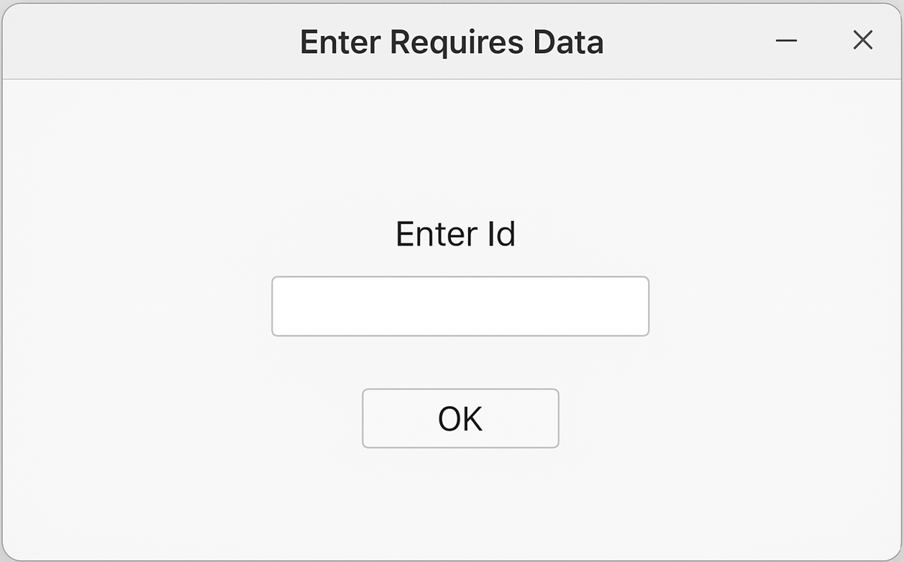
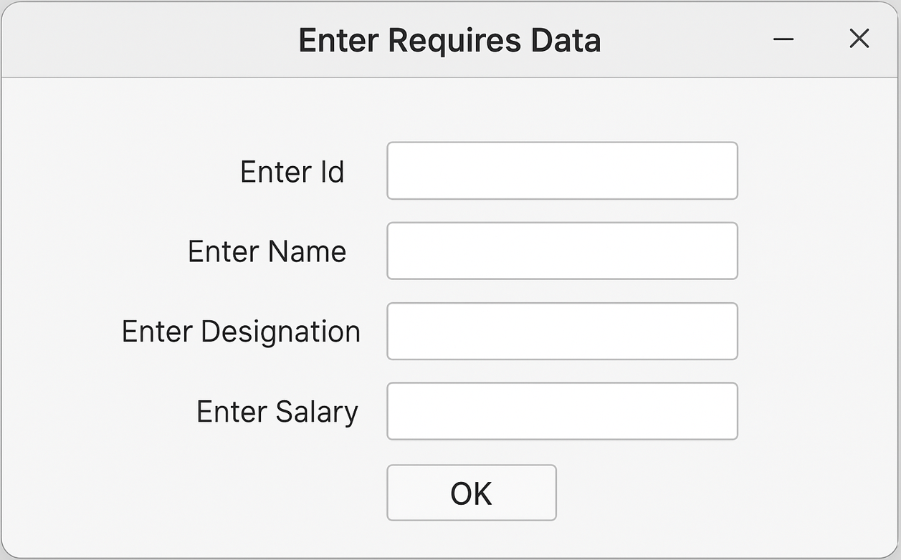
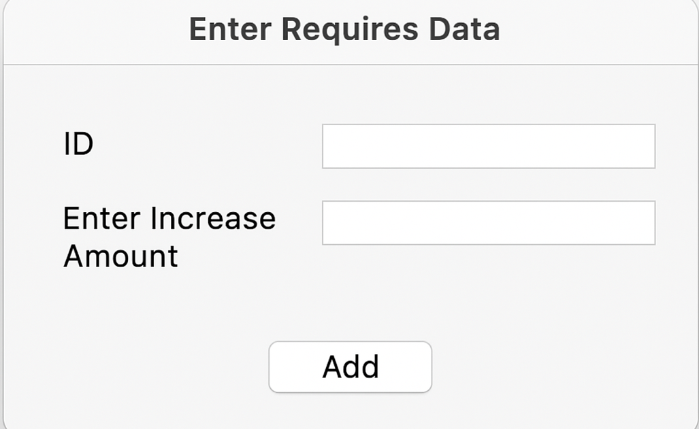
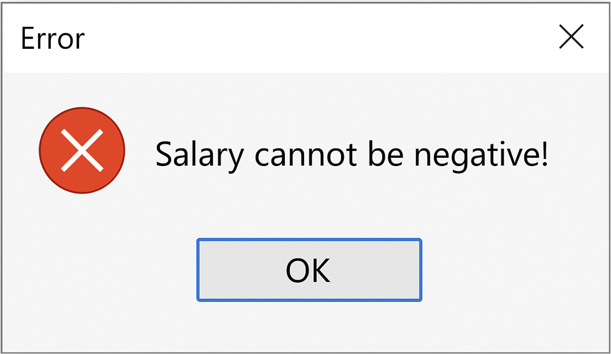
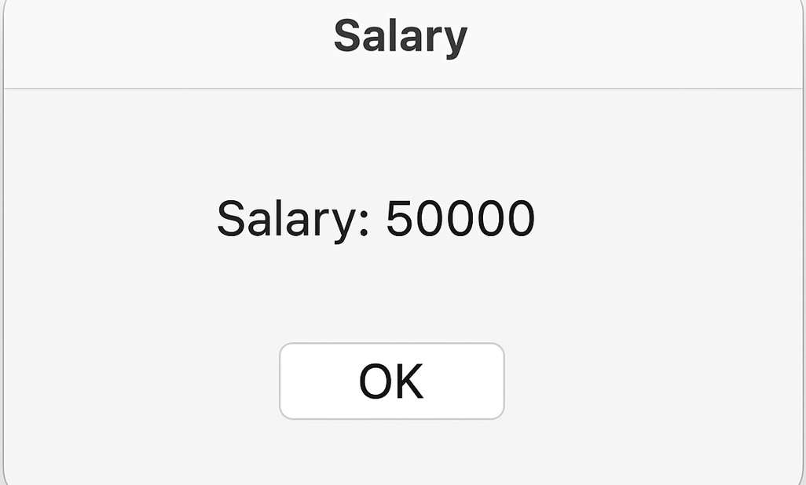
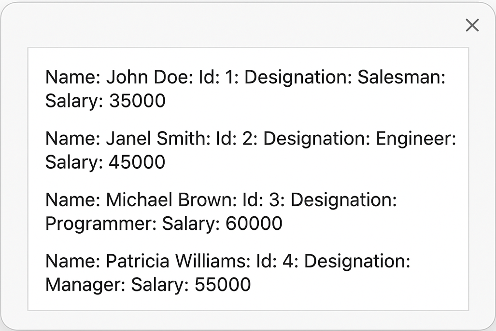

## Employee Management System using Java

This project is basically a JavaFX employee management system. When the main class runs, it first tries to load employee data from 
data.txt using serialization. If there’s no data, it just starts fresh with a new UapCse object that holds all the employee records. The interface of this project is fully 
GUI-based. From the FrontPage, we can add employees or view details. If we choose to add employees, a window pops up (AddEmployee) where we select whether we want to 
add a salaried, hourly or commission employee. Each choice opens its own window (like AddSalariedEmployee) where add the name, ID, designation, and salary of employees. 
Once we click add, the data gets stored inside Main.uc, the main UapCse object. Employees are modeled through their own classes—SalariedEmployee, HourlyEmployee, 
CommissionEmployee—and there’s also InvalidSalaryException to throw error if invalid salary is entered. Data gets saved back to data.txt using serialization so nothing’s lost 
when we close the app. And to make it look nicer, the UI uses a stylesheet (Viper.css). So overall, this project is a simple desktop app where we can add, store, and manage 
different types of employees in a simple interface.  

The front page is built with a simple JavaFX window that asks for email and password, styled with Viper.css. Once we click on the sign-in button, it opens up another window with options like adding employees, checking specific salary or details, increasing salary, viewing all employees, or exiting. When we exit, it saves all the data before closing the app.

Add Employee button opens up a new window where we get three buttons to choose the type of employee we want to add: salaried, hourly, or commission. 
When we click on one, it instantly takes us to the specific form for that employee type. 

AddSalariedEmployee, AddHourlyEmployee, and AddCommissionEmployee, these three classes are basically forms that let us add different types of employees. Each one opens a new window with text fields for the employee’s details. We type in employee name, ID, designation, and the relevant salary info, like monthly salary, hourly rate, or commission details. Each form has an “Add” button, and when we click it, the data goes straight into Main.uc, our main employee container and employee info get stored. The layout uses VBox and a little padding to make it look clean. 

The class AddSpecificEmployeeDis lets us add a specific employee by taking their ID. When we click on “OK,” it calls Main.uc.display(tfId.getText()), which handles adding or updating that employee in the main UapCse data structure. Once the operation is done, the method executes, effectively saving the specific employee details into our main employee list.

AddIncreaseSalary class takes an employee ID and an amount we want to increase. Then it calls Main.uc.increaseSalary(id, amount) to update the employee’s salary inside the main UapCse object. If the amount is valid, the salary gets updated. But if the salary is invalid, it throws out custom InvalidSalaryException. That exception is caught, and an error message is displayed.

The SpecificEmployeeSalary class requires us to enter an employee’s ID. When we click on OK button, this class takes that ID and calls Main.uc.getSalary() with it. That function checks the stored employee records inside the UapCse object. It then finds the matching employee and pulls out their salary and displays the salary in a message box.

The DisplayListView class has a function called DisplayListView(). When 'All Employee Information' button is clicked, then DisplayListView() function is called. It first clears out any old data and then loops through all employees stored in Main.uc.employees. For every employee, it displays their name, id, designation, and salary using getter methods and builds a formatted string. These strings get added to the data list, which is directly connected to the list view. 

