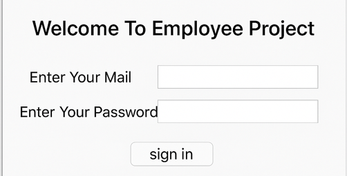
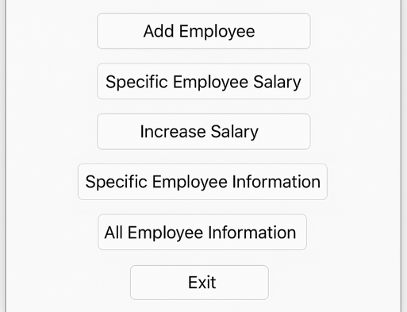
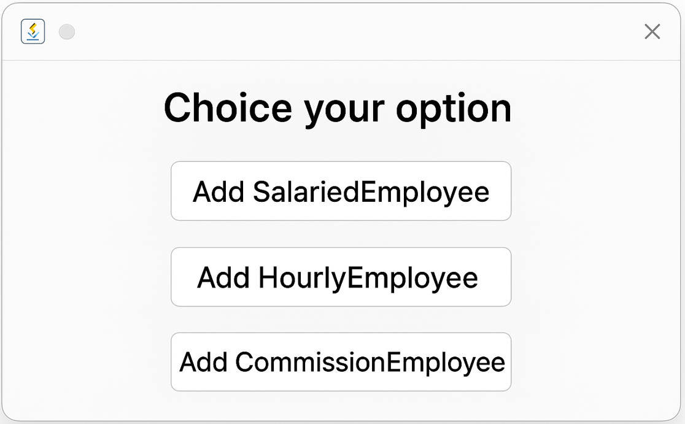
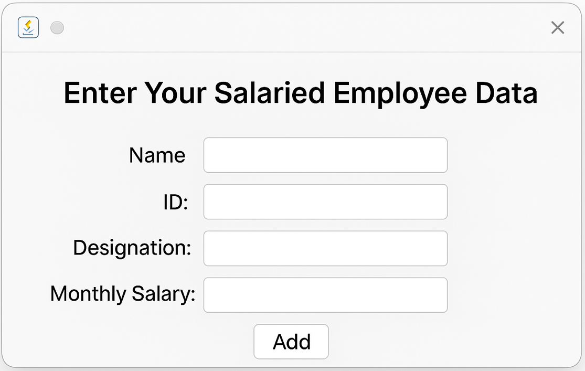
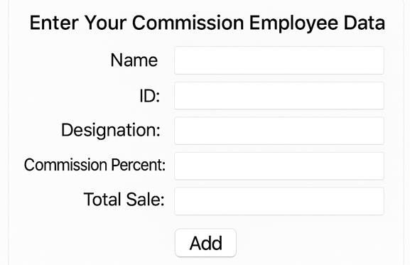
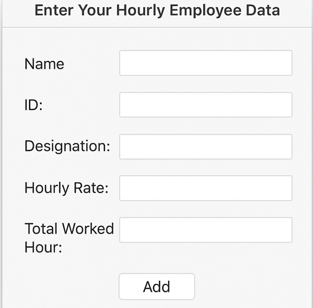

## Employee Management System using Java

This project is basically a JavaFX employee management system where everything starts from the Main class. When the main class runs, it first tries to load employee data from 
data.txt using serialization. If there’s no data, it just starts fresh with a new UapCse object that holds all the employee records. The interface of this project is fully 
GUI-based. From the FrontPage, we can add employees or view details. If we choose to add employees, a window pops up (AddEmployee) where we select whether we want to 
add a salaried, hourly or commission employee. Each choice opens its own window (like AddSalariedEmployee) where add the name, ID, designation, and salary. 
Once we hit add, the data gets stored inside Main.uc, the main UapCse object. Employees are modeled through their own classes—SalariedEmployee, HourlyEmployee, 
CommissionEmployee—and there’s also InvalidSalaryException to keep things consistent. Data gets saved back to data.txt using serialization so nothing’s lost 
when we close the app. And to make it look nicer, the UI uses a stylesheet (Viper.css). So overall, it’s a simple desktop app where we can add, store, and manage 
different types of employees in a simple interface.  

The front page is built with a simple JavaFX window that asks for email and password, styled with Viper.css. Once we hit the sign-in button, it opens up another window with 
options like adding employees, checking specific salary or details, increasing salary, viewing all employees, or exiting. When we exit, it saves all the data before closing 
the app.

Add employee opens up a new window where we get three buttons to choose the type of employee we want to add—salaried, hourly, or commission. 
When we click on one, it instantly takes us to the specific form for that employee type. 

AddSalariedEmployee, AddHourlyEmployee, and AddCommissionEmployee, these three classes are basically forms that let us add different types of employees. Each one opens a new window with text fields for the employee’s details. We type in employee name, ID, designation, and the relevant salary info, like monthly salary, hourly rate, or commission details. Each form has an “Add” button, and when we click it, the data goes straight into Main.uc, our main employee container and employee info get stored. The layout uses VBox and a little padding to make it look clean, and Viper.css styles everything. 

